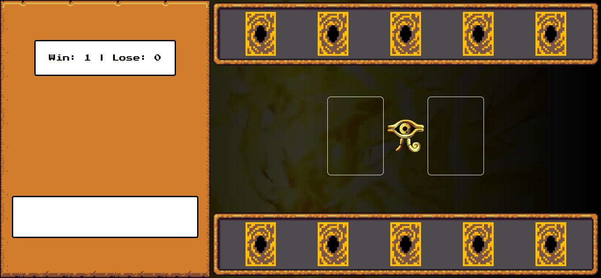

# 🃏 Yu-Gi-YO: Jo-Ken-Po Edition

Um jogo web interativo inspirado no universo de **Yu-Gi-Oh!**, utilizando as regras de **pedra, papel e tesoura** (Jo-Ken-Po). Escolha sua carta, desafie o computador e veja quem vence o duelo!

## 🎥 Demonstração do Jogo

## Clique abaixo para ver uma prévia do jogo em ação:

📽️ [`yugi.mp4`](./src//Yu-Gi-YO%20Jo-ken-po%20Edition%20-%20Google%20Chrome%202025-07-01%2009-52-58.mp4)

---

## 🚀 Tecnologias Utilizadas

- HTML5
- CSS3 (com reset, responsividade e animações)
- JavaScript (puro, sem frameworks)
- Áudio e vídeo para imersão

---

## 🎮 Como Jogar

1. Abra o projeto em seu navegador.
2. Passe o mouse sobre as cartas para visualizar os detalhes.
3. Clique em uma carta para jogar contra o computador.
4. Veja o resultado do duelo e o placar atualizado.
5. Clique em **"Ganhou"**, **"Perdeu"** ou **"Empate"** para reiniciar o duelo.

---
## 🧠 Lógica do Jogo
Cada carta tem um atributo:

__Blue Eyes White Dragon__ → Papel

__Dark Magician__ → Pedra

__Exodia__ → Tesoura

As regras seguem o padrão:

__Pedra vence Tesoura__
__Tesoura vence Papel__
**Papel vence Pedra**

## 💻 Autor

### Feito com 💙 por **_Samira_**  
  

---